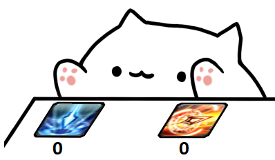

# BongoCat KeyCounter
<br/>
FF14에서 스킬을 사용한 횟수를 기록하는 프로그램. 그러니까... 버튼을 누르면 숫자가 올라요.
## 키 설정
**counter_config.json** 파일을 메모장으로 열어주세요.

```
{
  "keys": [
    "q",
    "e"
  ],
  "counts": {
    "key1": 0,
    "key2": 0
  },
  "delay": {
    "key1": 2.5,
    "key2": 2.5
  }
}
```

**"keys"** : 키를 두 개 지정합니다. 기본값은 q, e 입니다.<br/>
**"counts"** : 키를 누른 횟수.<br/>
**"delay"** : 딜레이를 설정합니다. 키를 누르면, 설정한 시간(초)동안 카운터가 멈춥니다. 기본값은 2.5초 입니다.

**조합키는 불가능합니다.** (ctrl+1, shift+q 등...)<br/>
넘버패드 키는 "num0", "num1" ...<br/>
마우스 엄지 버튼은 "mouse4", "mouse5"로 가능합니다.


## 스킬 이미지 변경
**img 폴더** 내에 있는 이미지를 변경해야 합니다.<br/>
설정할 스킬 아이콘을 img 폴더 내에 넣고, 이름을 skill1.png, skill2.png로 바꿔주세요.<br/>
스킬 아이콘은 FF14 Fan Kit의 스킬 아이콘을 사용해주세요.<br/>
https://na.finalfantasyxiv.com/lodestone/special/fankit/icon/

## 종료하기
작업표시줄의 본 프로그램을 우클릭 후 종료해주세요.

## OBS
윈도우 캡쳐에서, 캡쳐 방식을 window 10으로 설정해주세요.
